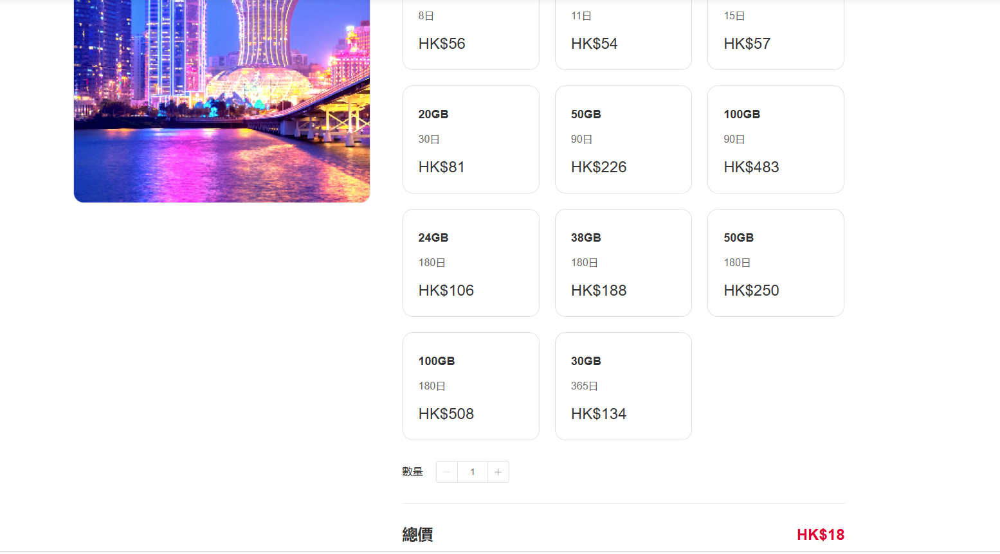
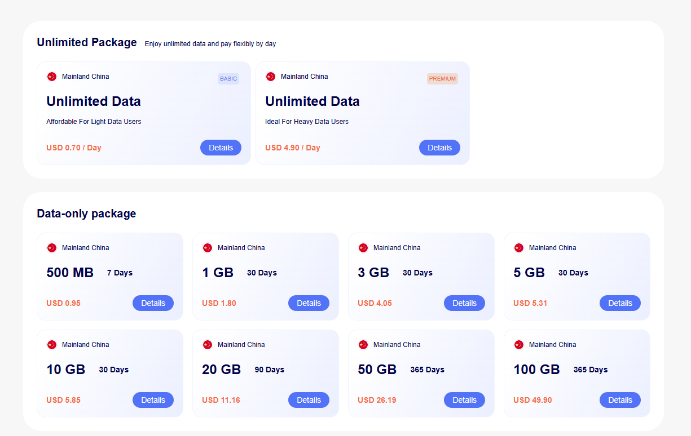
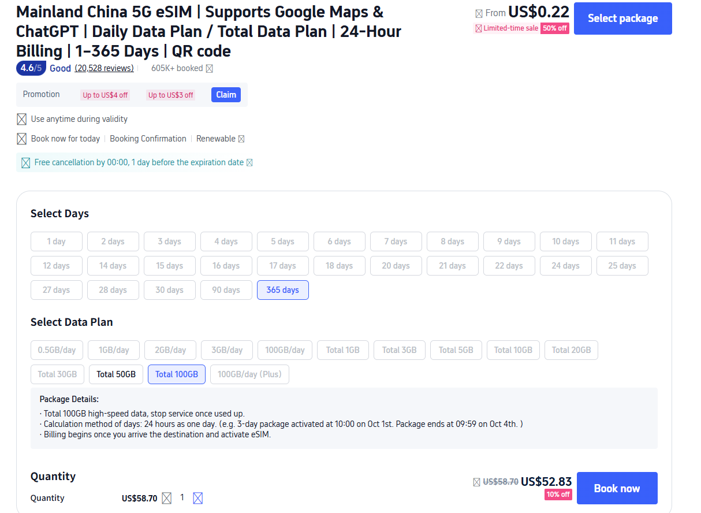
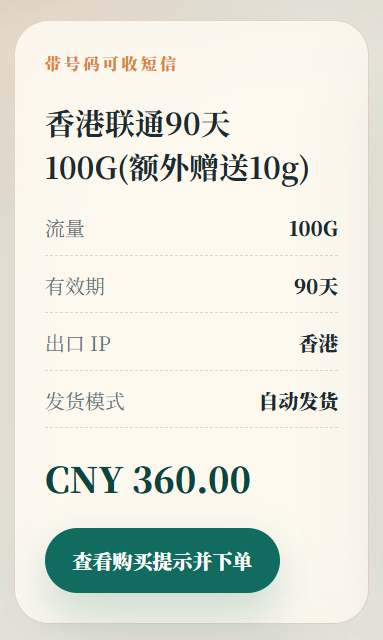
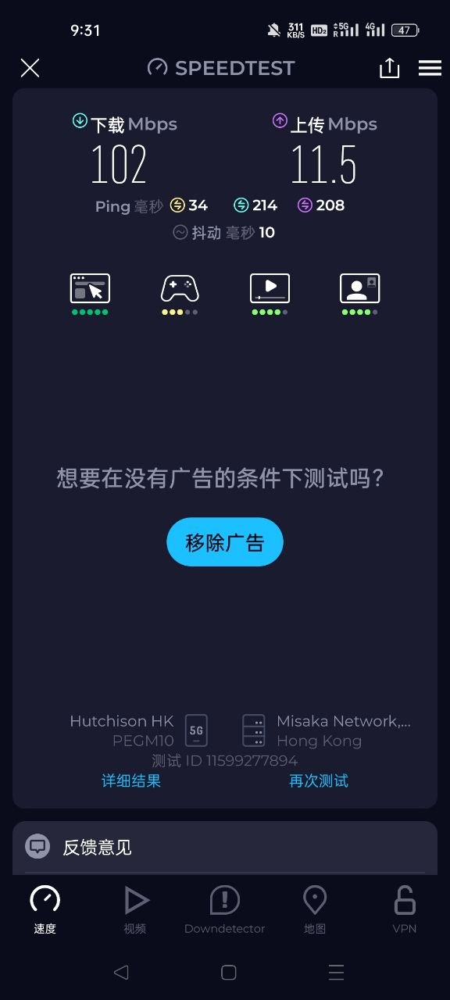
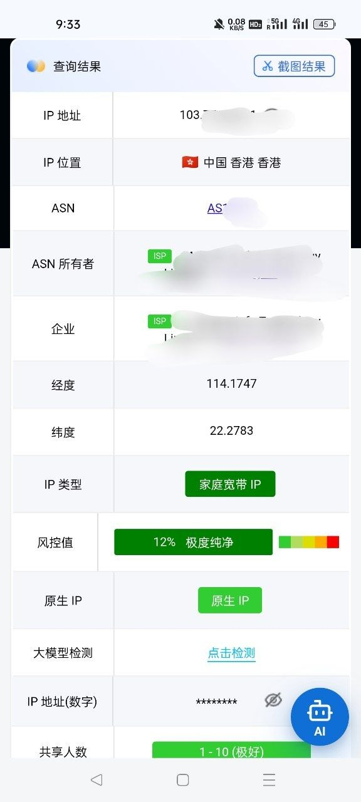
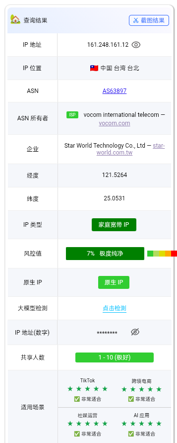
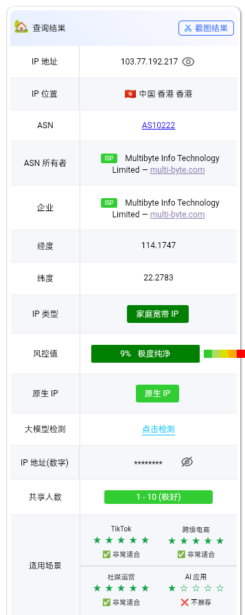
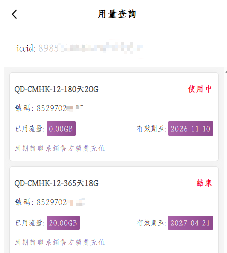

# 中国 eSIM 怎么选：香港线路、原生 IP、短信续费、自动发卡一页看懂

如果你正在找 `中国 eSIM`、`中国内地可用 eSIM`、`香港 eSIM 中国能用吗`、`中国 eSIM 热点共享`、`香港号码 eSIM`，你大概率不是想看一堆术语，而是想尽快判断这张卡值不值得买、买完能不能省心用。

这个仓库和独立页面，就是按这个思路写的：先帮客户看明白，再决定要不要去 `esimka.top` 下单。

这里把和 `esimka.top` 最相关、最容易影响下单的点拆成可核对的图文模块：

- 价格对比，不只看总价，更看每 GB 成本
- CMLink 相关激活门槛变化，提醒购买前先看规则
- 香港线路、原生 IP、家庭宽带 IP、低共享人数、低风控截图样例
- 香港号码 eSIM、短信接收、续费与长期保号场景
- 自动发卡、无需邮寄、快速触达国际网络

独立页面地址：

[https://rul2tlf-maker.github.io/china-esim-proof-gallery-guide/](https://rul2tlf-maker.github.io/china-esim-proof-gallery-guide/)

## 为什么这页更适合客户

很多用户搜索 `中国 eSIM` 时，真正关心的不是一句“能用”，而是下面这些会直接影响购买的问题：

1. 中国内地到底能不能用
2. 会不会有境外预激活门槛
3. 香港 eSIM 中国能用吗
4. 能不能开热点给电脑
5. 有没有香港号码和短信能力
6. 是否支持续费，能不能少换号
7. 出口是不是香港线路或原生 IP
8. 价格是不是只便宜，但别的能力都缺

这也是这个 README 和独立页面的结构逻辑。

## 页面里放了哪些卖点图片

本仓库页面已经放入当前卖点资料里最重要的一组截图：

### 1. 价格与套餐截图

- 用于解释中国联通香港 eSIM 的价格带
- 根据现有卖点文档，可见最低档位可折算到约 `3.51 CNY/G`

- 用于解释为什么买中国相关 eSIM 不能只看总价
- 当前素材口径中，`8GB / 180 天 / 86.9 CNY` 大约折算 `10.86 CNY/G`

- 用于说明第三方平台页面更花，但判断时仍要回到有效期、总量、计费方式和可用区域

### 2. 本站套餐截图

这张图最适合承接 `esimka.top` 的核心卖点组合：

- 香港联通 90 天 100G
- 额外赠送 10G
- 香港出口 IP
- 自动发货
- 带号码可收短信

也就是说，它不是单纯一张价格卡，而是把 `香港 eSIM`、`短信能力`、`自动发卡`、`中国内地可用 eSIM` 的转化点放到了同一张图里。

### 3. 网络环境与原生 IP 证据

- 适合解释移动数据链路、热点共享、备用网络场景

- 适合解释香港出口样例
- 页面中按“样例截图”表述，不做绝对化固定出口承诺

这两张图最适合承接下面这组 SEO 关键词和卖点词：

- `原生 IP eSIM`
- `香港 IP eSIM`
- `家庭宽带 IP`
- `低共享人数`
- `低风控`
- `跨境电商`
- `社媒运营`
- `账号环境`

按当前卖点文档，这组图更稳妥的写法是：

> 有原生 IP、家庭宽带 IP、低共享人数和低风控值的样例截图，更适合解释为什么这类线路在跨境账号、跨境电商和社媒运营场景里更受关注。

### 4. 续费与短信保号截图

这张图重点不是“炫后台”，而是支持下面这些用户问题：

- 香港号码 eSIM 能不能接短信
- 中国 eSIM 长期使用值不值得
- 续费后原号码还能不能继续用
- 用量、状态、有效期能不能看清楚

## 结合卖点后的核心判断

### 价格

不是只看“谁最便宜”，而是看：

- 每 GB 成本
- 是否带香港线路
- 是否带号码短信
- 是否支持自动发卡
- 是否存在激活门槛

### 激活

卖点资料已经整理出 `CMLink` 相关的激活限制参考，所以更稳的购买思路是：

- 买前先看能否在中国内地直接启用
- 先看有没有境外预激活要求
- 再看套餐价格

### 原生 IP 与网络环境

如果你的需求涉及：

- 国际网络访问
- 跨境电商
- 社媒运营
- 香港线路
- 电脑热点共享

那你更该看的是截图里的出口环境、原生 IP、共享人数和风控值，而不是只看“海外流量”四个字。

### 短信与长期使用

如果你需要：

- 香港号码 eSIM
- 接验证码短信
- 长期备用号
- 减少频繁换号

那续费与保号逻辑就会比纯低价更重要。

### 快速交付

`esimka.top` 的软广切入点，不应该只是“卖卡”，而是：

> 更快拿到一条国际移动数据通道，少一步邮寄等待，少一些线下收件信息暴露，少一点开通摩擦。

## 适合怎么推广 esimka.top

更适合的表达：

- 中国内地可用 eSIM 的完整判断页
- 香港 eSIM 中国能用吗的截图型参考
- 中国 eSIM 热点共享与原生 IP 研究页
- 香港号码 eSIM、短信和续费场景说明

不建议只写得像一句强广告。

更适合的软引导方式：

> 如果你已经确认自己想要的是中国内地可用 eSIM、香港线路、原生 IP、短信能力和更轻的开通流程，可以继续看 [esimka.top](https://esimka.top/) 的实际套餐页。

## 合规说明

- 套餐价格、激活门槛、覆盖范围、号码能力、续费规则与 IP 显示可能随供应商和运营商规则调整
- 页面中的香港与台湾 IP 截图按样例证据使用，不写成永久固定出口承诺
- 页面中的隐私表达采用“更高隐私弹性”“减少本地网络侧访问痕迹”口径，不做绝对匿名承诺
- 使用 eSIM、漫游与跨境数据服务时，请遵守当地法律、运营商规则和平台条款
